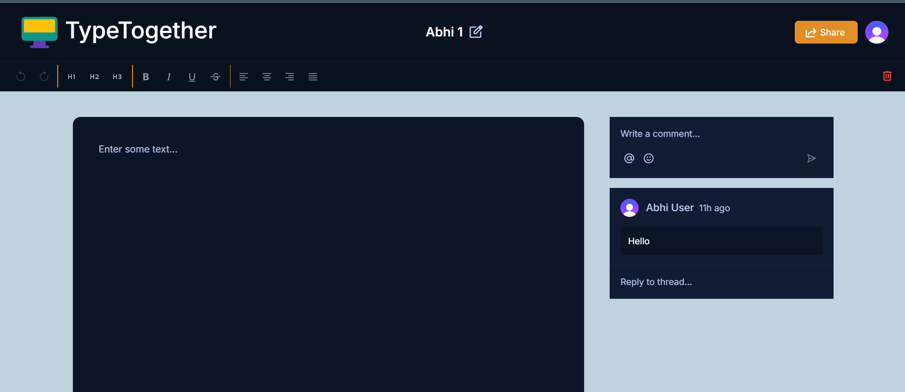

# TypeTogether
TypeTogether is a full-stack, real-time collaborative document editor built with Next.js, Liveblocks, Clerk, Lexical, Typescript and Tailwind CSS. It empowers users to create, edit, and share documents with seamless real-time collaboration, live presence, and threaded commenting. Designed for teams and individuals, TypeTogether delivers a modern, secure, and highly interactive editing experience.

# Demo
- **[Live Demo]()** : Check out the live version of TypeTogether to see its features in action.
# Video
- **[Project Overview Video]()**: Watch a video demonstration of the project, including its main features and functionality.

---

## Screenshots




---

## Table of Contents

- [Features](#features)
- [Tech Stack](#tech-stack)
- [Architecture & Flow](#architecture--flow)
- [Liveblocks Integration](#liveblocks-integration)
- [Project Structure](#project-structure)
- [Getting Started](#getting-started)
- [Customization](#customization)
- [Contributing](#contributing)
- [License](#license)

---

## Features

- **Real-time Collaboration:** Multiple users can edit the same document simultaneously, with changes instantly reflected for all participants.
- **Live Presence:** See who is online, their avatars, and their current activity in the document.
- **Threaded Comments:** Add comments, reply in threads, and resolve discussions directly in the document.
- **Authentication:** Secure sign-in and user management powered by Clerk.
- **Role-based Access:** Assign users as editors or viewers with granular permissions.
- **Document Management:** Create, view, and delete documents with a user-friendly interface.
- **User Mentions:** Mention other collaborators in comments and threads.
- **Notifications:** In-app notifications for document activity.
- **Responsive UI:** Beautiful, accessible, and responsive design using Tailwind CSS and Radix UI.
- **Custom Theming:** Dark mode and custom color palette for a modern look.

---

## Tech Stack

- **Frontend:** Next.js 14, React 18, TypeScript, Tailwind CSS, Radix UI, Lucide Icons
- **Collaboration:** Liveblocks (real-time presence, storage, comments, threads)
- **Authentication:** Clerk (user management, sign-in, sign-up)
- **Rich Text Editing:** Lexical (by Meta)
- **State Management:** React Context, Liveblocks hooks
- **Other:** NanoID (unique IDs), class-variance-authority, clsx, tailwind-merge

---

## Architecture & Flow

### 1. Authentication & User Management

- Users sign in or sign up using Clerk.
- Clerk manages user sessions, profile data, and provides secure authentication.
- User data (name, email, avatar, color) is used throughout the app for presence, comments, and permissions.

### 2. Document Management

- Users can create new documents, which are stored as data objects (not files) in a backend database or real-time storage (via Liveblocks).
- The document list is fetched and displayed on the dashboard, showing all documents the user has access to.
- Each document can be opened, edited, or deleted (with confirmation).

### 3. Real-time Collaboration with Liveblocks

- When a document is opened, the editor is initialized with Liveblocks.
- Liveblocks provides:
  - **Presence:** See who is online, their avatars, and their current selection/cursor.
  - **Storage:** All document content and comments are synchronized in real-time.
  - **Threads & Comments:** Users can add comments, reply in threads, and resolve discussions. Comments are synced live.
  - **User Metadata:** Each user’s name, avatar, and color are shown in the UI.
- All collaboration features are powered by Liveblocks’ React and Lexical integrations.

### 4. Rich Text Editing

- The editor uses Lexical for fast, extensible, and accessible rich text editing.
- Custom plugins provide toolbars, formatting, and integration with Liveblocks for collaborative editing and comments.

### 5. UI & Theming

- The UI is built with Tailwind CSS and Radix UI for accessibility and responsiveness.
- Custom themes and dark mode are supported.
- All components are modular and reusable.

---

## Liveblocks Integration

Liveblocks is the backbone of real-time collaboration in TypeTogether. Here’s how it’s used:

- **Authentication:** The app authenticates users with Liveblocks using a secure API route (`/api/liveblocks-auth`), passing Clerk user data and a unique color for each user.
- **Presence:** Liveblocks tracks which users are online, their cursors, and selections, and displays this in the editor.
- **Storage:** Document content, comments, and threads are stored in Liveblocks’ real-time storage, ensuring all users see updates instantly.
- **Threads & Comments:** Liveblocks’ comments API is used for threaded discussions, mentions, and notifications.
- **React & Lexical Integration:** The app uses `@liveblocks/react`, `@liveblocks/react-lexical`, and `@liveblocks/react-ui` to provide hooks and components for presence, storage, and comments.

**Why Liveblocks?**
- No need to build your own WebSocket or CRDT infrastructure.
- Handles real-time sync, presence, and comments out of the box.
- Scalable, secure, and easy to integrate with modern React apps.

---

## Project Structure

```
/app
  layout.tsx         # Root layout and providers
  Provider.tsx       # Liveblocks and Clerk context provider
  (root)/            # Main pages and document list
    page.tsx
    documents/[id]/  # Dynamic document editor pages
      page.tsx
  api/
    liveblocks-auth/ # API route for Liveblocks authentication

/components
  # UI and logic components (Editor, Toolbar, Comments, etc.)

/lib
  actions/           # Server actions for documents and users
  liveblocks.ts      # Liveblocks client setup
  utils.ts           # Utility functions

/public
  assets/            # Icons and images

/styles
  dark-theme.css     # Custom dark theme

/types
  index.d.ts         # TypeScript types
```

---

## Getting Started

### Prerequisites

- Node.js 18+
- Yarn or npm

### Installation

1. **Clone the repository:**
   ```sh
   git clone https://github.com/AbhishekNegi12/TypeTogether.git
   cd TypeTogether
   ```

2. **Install dependencies:**
   ```sh
   npm install
   # or
   yarn install
   ```

3. **Set up environment variables:**
   - Copy `.env.example` to `.env` and fill in your Clerk and Liveblocks keys.

4. **Run the development server:**
   ```sh
   npm run dev
   # or
   yarn dev
   ```

5. **Open [http://localhost:3000](http://localhost:3000) in your browser.**

### Deployment

- Deploy to Vercel, Netlify, or any platform that supports Next.js.
- Set environment variables in your deployment dashboard.

---

## Customization

- **Theming:** Edit `tailwind.config.ts` and `styles/dark-theme.css` for custom colors and themes.
- **Components:** Add or modify components in `/components` for new features or UI changes.
- **API & Actions:** Update `/lib/actions` and `/app/api` for backend logic.

---

## Contributing

1. Fork the repo
2. Create a new branch (`git checkout -b feature/your-feature`)
3. Commit your changes (`git commit -am 'Add new feature'`)
4. Push to the branch (`git push origin feature/your-feature`)
5. Create a Pull Request

---
